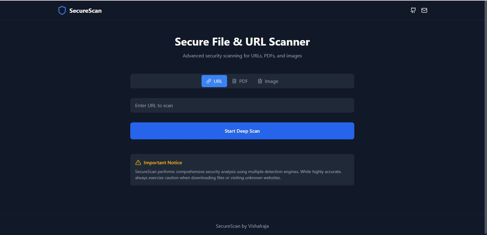
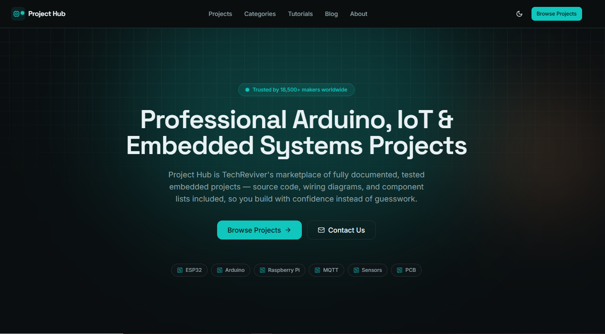

<div align="center">

```text

██╗   ██╗██╗███████╗██╗  ██╗ █████╗ ██╗         ██████╗  █████╗      ██╗ █████╗
██║   ██║██║██╔════╝██║  ██║██╔══██╗██║         ██╔══██╗██╔══██╗     ██║██╔══██╗
██║   ██║██║███████╗███████║███████║██║         ██████╔╝███████║     ██║███████║
╚██╗ ██╔╝██║╚════██║██╔══██║██╔══██║██║         ██╔══██╗██╔══██║██   ██║██╔══██║
 ╚████╔╝ ██║███████║██║  ██║██║  ██║███████╗    ██║  ██║██║  ██║╚█████╔╝██║  ██║
  ╚═══╝  ╚═╝╚══════╝╚═╝  ╚═╝╚═╝  ╚═╝╚══════╝    ╚═╝  ╚═╝╚═╝  ╚═╝ ╚════╝ ╚═╝  ╚═╝

```

[](https://git.io/typing-svg)

### Building secure backend systems with Java, Spring Boot & Cybersecurity.

</div>

---

# ~/whoami

```bash
visitor@github:~$ whoami

Name        : Vishal Raja L

Role        : Java Backend Engineer

Location    : India 🇮🇳

Mission     : Building secure, scalable software
              that solves real-world problems.

Focus       : Backend Engineering
              Cybersecurity
              Artificial Intelligence

Currently   : Spring Boot Microservices
              Cloud Technologies
              DevSecOps

Open To     : Open Source
              Collaborations
              Freelance
```

---

# ~/system_info

```bash
visitor@github:~$ neofetch

OS               : Linux

Editor           : IntelliJ IDEA | VS Code

Languages        : Java | Python | JavaScript | C

Backend          : Spring Boot | REST APIs

Frontend         : React | HTML | CSS | Bootstrap

Database         : MySQL | PostgreSQL | MongoDB

Version Control  : Git | GitHub

Current Status   : Coding...
```

---

> *"Secure code isn't just about preventing attacks—it's about building software people can trust."*

---
# ~/tech_stack

```bash
visitor@github:~$ ls tech_stack/
```

<div align="center">

## 💻 Programming Languages


<br><br>

## ⚙️ Backend Development


<br><br>

## 🎨 Frontend Development


<br><br>

## 🗄️ Databases


<br><br>

## ☁️ DevOps & Development Tools


</div>

---

# ~/cyber_security

```bash
visitor@github:~$ cat security_profile.conf
```

```yaml
Application Security:
  ✔ OWASP Top 10
  ✔ Secure Coding
  ✔ Authentication & Authorization
  ✔ REST API Security

Security Testing:
  ✔ Burp Suite
  ✔ Nmap
  ✔ Wireshark
  ✔ Vulnerability Assessment

Web Security:
  ✔ SQL Injection
  ✔ Cross-Site Scripting (XSS)
  ✔ CSRF
  ✔ Session Management

Development Practices:
  ✔ Secure API Design
  ✔ Input Validation
  ✔ JWT Authentication
  ✔ Password Hashing
```

---

# ~/current_learning

```bash
visitor@github:~$ roadmap --current
```

```text
Java 21                 ████████████████████████████ 100%

Spring Boot             ██████████████████████████░ 95%

Microservices           ████████████████████████░░ 88%

Docker                  ██████████████████████░░░░ 82%

Kubernetes              ██████████████████░░░░░░░░ 70%

AWS                     ███████████████░░░░░░░░░░░ 60%

DevSecOps               █████████████░░░░░░░░░░░░░ 55%

Artificial Intelligence ████████████████████░░░░░░ 80%
```

---

# ~/development_workflow

```bash
visitor@github:~$ cat workflow.sh
```

```text
        Idea 💡
          │
          ▼
   Design Solution
          │
          ▼
   Write Clean Code
          │
          ▼
   Security Testing
          │
          ▼
   Performance Optimization
          │
          ▼
   Deployment
          │
          ▼
Continuous Improvement 🚀
```

---

# ~/skill_matrix

```text
Backend Engineering      ████████████████████████ 95%

Spring Boot              ██████████████████████░ 90%

Cybersecurity            █████████████████████░░ 88%

Problem Solving          ████████████████████░░░ 85%

Artificial Intelligence  ██████████████████░░░░░ 80%

React Development        █████████████████░░░░░░ 72%

Docker                   ████████████████░░░░░░░ 68%

Cloud Computing          ██████████████░░░░░░░░░ 60%
```

---

<div align="center">

### 💡 *"The best software is not only functional—it is secure, scalable, and maintainable."*

</div>

---
# ~/featured_projects

```bash
visitor@github:~$ ls -la featured_projects/

drwxr-xr-x  Vulnerability Analyzer
drwxr-xr-x  ImgNest Studio
drwxr-xr-x  ProjectHub
drwxr-xr-x  LiveCode Studio
drwxr-xr-x  Resume Parser AI
drwxr-xr-x  Media Utility Suite
drwxr-xr-x  YouTube Downloader Pro
drwx------  Security Toolkit (Private)
```

<div align="center">

# 🚀 Featured Projects

### *Building software that combines Backend Engineering, Cybersecurity & Artificial Intelligence.*

</div>

---

<table>

<tr>

<td width="50%" valign="top">

## 🛡️ Vulnerability Analyzer

<!--

-->

AI-powered security platform that analyzes **URLs, PDFs and Images** to detect vulnerabilities and generate actionable security insights.

### ⚙ Tech Stack

`Java` `Spring Boot` `AI` `Security`

<br>

<a href="https://vulnerabilityanalyze.vercel.app/">

</a>

<a href="https://github.com/vishalrajal">

</a>

</td>

<td width="50%" valign="top">

## 🎨 ImgNest Studio

<!--

-->

Modern browser-based image editor with cropping, filters, annotations, resizing and instant exporting.

### ⚙ Tech Stack

`React`

`JavaScript`

`Canvas API`

<br>

<a href="https://imgnest.vishalraja.site/">

</a>

<a href="https://github.com/vishalrajal">

</a>

</td>

</tr>

<tr>

<td width="50%" valign="top">

## 🛒 ProjectHub

🚧 **Currently Under Active Development**

<!--

-->

Marketplace for developers to **buy, sell and showcase** software projects, templates and digital assets.

### ⚙ Tech Stack

`React`

`Node.js`

`MongoDB`

<br>

<a href="https://project-hub-lime.vercel.app/">

</a>

</td>

<td width="50%" valign="top">

## 💻 LiveCode Studio

<!--

-->

Online HTML, CSS & JavaScript playground featuring real-time preview for rapid frontend development.

### ⚙ Tech Stack

`HTML`

`CSS`

`JavaScript`

<br>

<a href="https://code-editor-by-vishy.vercel.app/">

</a>

</td>

</tr>

<tr>

<td width="50%" valign="top">

## 📄 Resume Parser AI

<!--

-->

AI-powered resume parser that extracts structured candidate information for recruitment workflows.

### ⚙ Tech Stack

`Python`

`AI`

`NLP`

<br>

<a href="https://github.com/vishalrajal/Resume_parser">

</a>

</td>

<td width="50%" valign="top">

## 🎬 Media Utility Suite

<!--

-->

Desktop toolkit for media conversion, compression, trimming, merging and advanced video processing.

### ⚙ Tech Stack

`Python`

`FFmpeg`

`Desktop`

<br>

<a href="https://github.com/vishalrajal/media-utility">

</a>

</td>

</tr>

<tr>

<td width="50%" valign="top">

## 📺 YouTube Downloader Pro

<!--

-->

Desktop application for downloading YouTube videos in multiple resolutions with a clean user interface.

### ⚙ Tech Stack

`Python`

`Desktop`

<br>

<a href="https://github.com/vishalrajal/youtube-downloader">

</a>

</td>

<td width="50%" valign="top">

## 🔒 Security Toolkit

Private Research Project

Advanced penetration testing toolkit focused on automation, reconnaissance, vulnerability assessment and secure development practices.

### 🔍 Research Areas

- Web Application Security
- Penetration Testing
- Reconnaissance
- Automation
- Secure Coding

### Status

```text
Repository : Private

Development : Active

Research : Ongoing
```

</td>

</tr>

</table>

---

```bash
visitor@github:~$ project_stats

Projects Built        : 15+

Live Deployments      : 4+

Research Projects     : 2

Open Source           : Growing

Current Focus         : Secure Backend Systems
```

---

<div align="center">

### ⭐ Every project is an opportunity to solve a real-world problem while writing secure, scalable and maintainable software.

</div>

---
# ~/github_dashboard

```bash
visitor@github:~$ systemctl status github

● GitHub Developer Profile

Status            : ONLINE

Repositories      : Synced

Contributions     : Updated

Activity          : Active

Developer Mode    : ENABLED
```

---

<div align="center">

# 📊 GitHub Statistics


</div>

---

<div align="center">

## 🔥 Contribution Streak


</div>

---

<div align="center">

## 📈 Contribution Activity

[](https://github.com/Ashutosh00710/github-readme-activity-graph)

</div>

---

<div align="center">

## 🏆 GitHub Trophies


</div>

---

# ~/developer_metrics

```text
██████████████████████████████████████████

Repository Health

Public Projects        ████████████████ 100%

Backend Projects       ███████████████░ 95%

Security Projects      ██████████████░░ 90%

Open Source            ████████████░░░░ 80%

Documentation          ███████████████░ 92%

Continuous Learning    ████████████████ 100%

██████████████████████████████████████████
```

---

# ~/current_focus

```text
Backend Engineering      ████████████████████████ 95%

Spring Boot              ██████████████████████░ 92%

Cybersecurity            █████████████████████░░ 90%

Microservices            ████████████████████░░░ 86%

Problem Solving          ███████████████████░░░░ 84%

Artificial Intelligence  ██████████████████░░░░░ 80%

Cloud Computing          ███████████████░░░░░░░░ 65%

DevSecOps                █████████████░░░░░░░░░░ 58%
```

---

# ~/git_activity.log

```bash
visitor@github:~$ git status

On branch main

✔ Building backend applications

✔ Exploring cybersecurity

✔ Learning cloud technologies

✔ Improving system design

✔ Contributing to open source

Nothing to commit, working tree clean.
```

---

<div align="center">

### 💚 Every green square represents another step toward becoming a better engineer.

</div>

---
# ~/achievements

```bash
visitor@github:~$ achievements --list

Loading achievements...
████████████████████████████████████ 100%

Status : SUCCESS
```

<div align="center">

# 🏆 GitHub Achievements


</div>

---

<div align="center">

# 🐍 Contribution Snake


</div>

> **Note:** Configure the GitHub Action to generate the snake animation automatically.

---

# ~/certifications

```bash
visitor@github:~$ cat certifications.yml
```

```yaml
Completed:

✔ Java Programming

✔ Spring Framework

✔ SQL & Database Design

✔ REST API Development

✔ Web Application Security

Learning:

□ Docker

□ Kubernetes

□ AWS Cloud

□ DevSecOps

□ Advanced Spring Security
```

---

# ~/learning_roadmap

```bash
visitor@github:~$ roadmap --2026
```

```text
✔ Build Production Ready Applications

✔ Master Spring Boot

✔ Learn Microservices Architecture

✔ Master Docker

✔ Learn Kubernetes

✔ Learn AWS

✔ Contribute More to Open Source

✔ Publish Security Research

✔ Build AI Powered Security Tools

✔ Become a Better Software Engineer
```

---

# ~/terminal_quote

```bash
visitor@github:~$ fortune

"Programs must be written for people to read,
and only incidentally for machines to execute."

— Harold Abelson
```

---

# ~/visitor_count

<div align="center">


</div>

---

# ~/connect

```bash
visitor@github:~$ connect --social
```

<div align="center">

<a href="https://github.com/vishalrajal">

</a>

<a href="https://www.linkedin.com/in/vishalrajal">

</a>

<a href="mailto:your-email@example.com">

</a>

<a href="https://vishalraja.techreviver.in/">

</a>

</div>

---

# ~/terminal

```bash
visitor@github:~$ whoami

Vishal Raja L

Java Backend Engineer

Cybersecurity Researcher

Building secure & scalable applications.

visitor@github:~$ echo $MISSION

"Learn. Build. Secure. Repeat."

visitor@github:~$ logout

Session terminated.

Thank you for visiting.

visitor@github:~$ █
```

---

<div align="center">

### ⭐ If you enjoy my work, consider giving a ⭐ to my repositories and following my journey!

</div>

---

<div align="center">


</div>